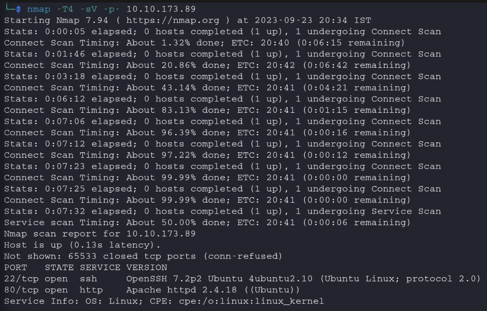

# Level 0

### Level Goal:

The goal of this level is for you to log into the game using SSH. The host to which you need to connect is [**bandit.labs.overthewire.org**](http://bandit.labs.overthewire.org), on port 2220. The username is **bandit0** and the password is **bandit0**. Once logged in, go to the [Level 1](https://overthewire.org/wargames/bandit/bandit1.html) page to find out how to beat Level 1.

#### Commands you may need to solve this level:

[ssh](https://man7.org/linux/man-pages/man1/ssh.1.html)

### Solution:

```bash
-l = login name
-p = port
```

<figure><figcaption></figcaption></figure>
